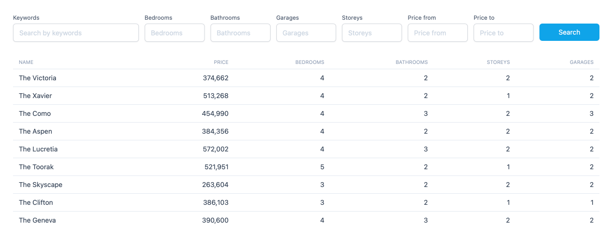

## Description

This is a simple Laravel/Vue application to search realty properties by parameters. Made for demo purposes.



## Installation

### Run docker containers

```
docker-compose up
```

### Install php dependencies

```
docker exec -it property-search-php sh -c "composer install"
```

### Copy .env file

```
cp .env.example .env
```

### Generate app key

```
docker exec -it property-search-php sh -c "php artisan key:generate"
```

### Run database migrations

```
docker exec -it property-search-php sh -c "php artisan migrate"
```

### Run database seeders

```
docker exec -it property-search-php sh -c "php artisan db:seed"
```

### Install js dependencies

```
npm install
```

### Run frontend watchers

```
npm run dev
```

### Or compile frontend assets

```
npm run build
```

### Open app in browser

```
http://localhost:8080
```
